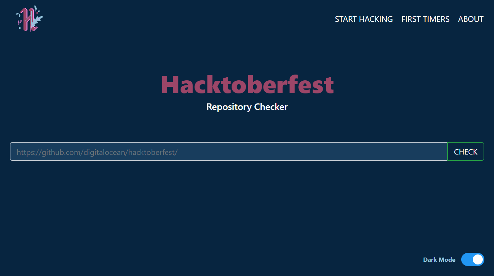

<h2 align="center">Hacktoberfest Repository Checker</h2>

checks if the given repository is participating to hacktoberfest

----

<strong><a href="#Installation">Install</a></strong>
|
<strong><a href="https://hacktoberfest.cf/">🔗Demo</a></strong>
|
<strong><a href="#API">API</a></strong>
|
<strong><a href="#Contributing">Contributing</a></strong>

----

</img>

  
Dark Mode

  
</img>

### ⚡Installation
1. Fork the project
2. Clone the project with `git clone https://<yourgithubusername>/Hacktoberfest-Repo-Checker.git ` 

3. Then cd in your project folder with  `cd Hacktoberfest-Repo-Checker ` 

4. Then install npm packages with `npm i` 

5. Start the server with `node .`

6. Your server should be running at `https://localhost:8080`

### 🔌API
- The project also has a public api currently in testing. You can access it at `hacktoberfest.cf/api?url=<url of repo>`

### 💕Contributing
- The project is open for contributions. You can make a issue or assign yourselves one and then can start working upon it. The project uses node.js for serving the files in combination with ejs as the templating engine. While making a pull request, make sure to pr to the dev branch rather than the master branch.

**The website is hosted by resources from fosshost. Fosshost is a non profit organisation who provides compute resources/dns/domains to open source projects. Be sure to check them out**

## Happy Hacking!
