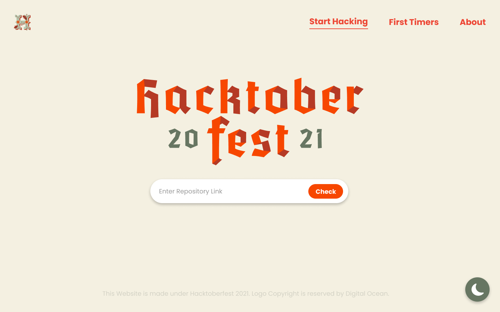
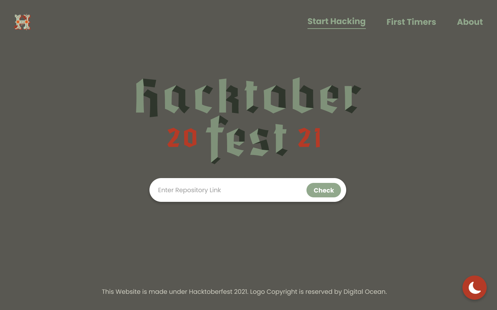

<h1 align="center" style="font-weight: bold;">Hacktoberfest Repository Checker</h1>

Checks if the given repository is participating to hacktoberfest

---

<strong><a href="#Installation">Install</a></strong>
|
<strong><a href="https://hacktoberfest.cf">🔗Demo</a></strong>
|
<strong><a href="#API">API</a></strong>
|
<strong><a href="#Contributing">Contributing</a></strong>

---

</img>

  
Dark Mode

  
</img>

## **Installation**

1\. Fork the project  2\. Clone the project with `git clone https://<yourgithubusername>/Hacktoberfest-Repo-Checker.git `  3\. Then cd in your project folder with `cd Hacktoberfest-Repo-Checker `  4\. Then install npm packages with `npm i`  5\. Start the server with `node .`  6\. Your server should be running at `https://localhost:8080`

## **🔌API**

- The project also has a public api currently in testing. You can access it at `https://hacktoberfest.cf/api?url=%repo_url%`

## **💕Contributing**

- The project is open for contributions. You can make an issue or assign yourselves one and then can start working on it. The project uses node.js for serving the files in combination with ejs as the templating engine. While making a pull request, make sure to pr to the dev branch rather than the master branch.

**The website is hosted by resources from fosshost. Fosshost is a non-profit organisation that provides compute resources/dns/domains to open-source projects. Be sure to check them out**

## Thanks to all Contributors

# **Happy Hacking!**
If you liked this project, please leave a 🌟
